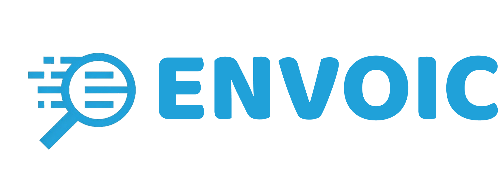
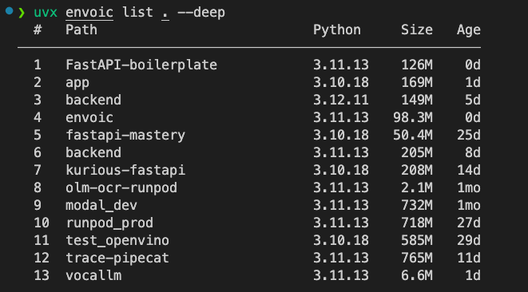

<p align="center">
  
</p>

---

Discover Python virtual environments and report them in a compact terminal layout.


> [!WARNING]
> `envoic` is still experimental and therefore subject to major changes across releases. Breaking changes may occur until `v1.0.0`.


# Installation

```bash
$ uv tool install envoic

# or

$ pipx install envoic
```

Run without installing:

```bash
$ uvx envoic scan .
```


# Sample Outputs

## 1. Scan

Scan the current directory for Python virtual environments.And, with `--deep` flag, it will scan the subdirectories too.


## 2. List

List the Python virtual environments in the current directory. And, with `--deep` flag, it will list the Python virtual environments in the subdirectories too.



## 3. Info

Get the information about the Python virtual environment in the current directory.


## Usage

```bash
$ envoic scan [PATH]

$ envoic list [PATH]

$ envoic manage [PATH]

$ envoic clean [PATH]

$ envoic info <ENV_PATH>

$ envoic version
```

Read more at [Documentation](https://mahimailabs.github.io/envoic/)


## Local Development

```bash
$ uv sync --group dev

$ uv run pytest

$ uv run python -m envoic.cli scan . --deep --path-mode name
```

## License

[MIT](LICENSE)
